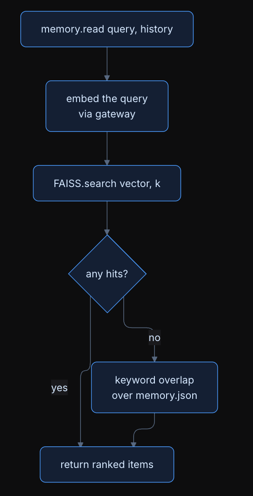

# 🧠 Agentic RAG — A Tool-Using AI Agent with Persistent Vector Memory

An autonomous AI agent that plans multi-step tasks, calls real tools over MCP, indexes documents into a local vector store, and **remembers what it learned across runs**. Built in Python with a strictly typed 5-layer architecture, FAISS semantic search, local embeddings via Ollama, and a multi-provider LLM gateway with automatic model routing.

> Ask it *"How does this paper handle the credit assignment problem?"* and it finds the right chunks even if that exact phrase never appears in the document — because retrieval works on **meaning**, not keywords.

---

## ✨ Key Features

- **Agentic loop** — decomposes a query into goals, then plans → acts → observes → re-plans for up to 20 iterations until every goal is done
- **Persistent vector memory** — facts, preferences, and tool outcomes survive restarts; stored in FAISS (768-dim embeddings) + JSON
- **True RAG pipeline** — chunk → embed → index → semantic retrieval → grounded synthesis, all running locally
- **11 real tools over MCP** — web search, URL fetching, timezone/currency utilities, a sandboxed filesystem, document indexing, and knowledge search
- **Content-addressed artifact store** — large tool outputs (fetched pages, big files) are stored by SHA-256 hash and passed by reference, keeping LLM prompts small
- **Multi-provider LLM gateway** — one API over Gemini, Groq, Cerebras, and GitHub Models with per-layer model routing (small models for cheap steps, large models for reasoning) and automatic failover
- **Typed contracts everywhere** — every layer exchanges Pydantic models, never loose dicts, so failures surface at the boundary instead of deep inside a prompt

---

## 🏗 Architecture

The agent is five single-responsibility layers connected by typed schemas. Each iteration of the main loop flows through all of them:

```
                    ┌──────────────────────────────────────────┐
                    │              agent7.py (loop)             │
                    └──────────────────────────────────────────┘
User Query
    ↓
1. MEMORY.read        FAISS vector search over stored items;
    ↓                 keyword-overlap fallback if vectors miss
2. PERCEPTION         iteration 1: decompose query into goals
    ↓                 later: mark goals done, pick next goal,
    ↓                 decide if raw artifact bytes are needed
3. DECISION           ONE LLM call: return either a final answer
    ↓                 or exactly one tool call (never both)
4. ACTION             execute the MCP tool; results > 4 KB go to
    ↓                 the artifact store, returned as art:<hash>
5. MEMORY.record      persist the outcome (zero LLM calls)
    ↓
(repeat until all goals complete, max 20 iterations)
```

**Separation of concerns is enforced, not aspirational.** Perception never sees tool names. Decision makes exactly one LLM call per turn. Action never calls an LLM at all. Memory writes on the hot path (`record_outcome`) use zero LLM calls so tool results are never lost to a flaky model.

### Components

| File | Responsibility |
|---|---|
| `agent7.py` | Main loop, goal tracking, artifact resolution, rate-limit pacing |
| `perception.py` | Query → goals; goal completion tracking; artifact-attachment decisions |
| `decision.py` | The single reasoning call: answer or one `ToolCall` |
| `action.py` | Pure MCP dispatcher + artifact-store guard rails |
| `memory.py` | 4 memory kinds (`fact`, `preference`, `tool_outcome`, `scratchpad`), vector + keyword retrieval |
| `vector_index.py` | FAISS `IndexFlatIP` on L2-normalized vectors (= cosine similarity), persisted to disk |
| `artifacts.py` | SHA-256 content-addressed blob store with metadata sidecars, dedup by hash |
| `mcp_server.py` | The 11 MCP tools (FastMCP, stdio transport) |
| `gateway.py` | Client for the LLM gateway; auto-starts it; exposes `LLM` and `embed()` |
| `schemas.py` | All Pydantic contracts: `MemoryItem`, `Goal`, `Observation`, `DecisionOutput`, `ToolCall`, `Artifact` |

---

## 🔄 The Process — What Actually Happens on a Query

Walkthrough for `uv run agent7.py "Index attention.md and tell me its key contributions"`:

1. **Boot** — `ensure_gateway()` health-checks the LLM gateway on port 8107 and auto-starts it if it's down.
2. **Memory read** — the query is embedded (768-dim, `nomic-embed-text` via Ollama) and searched against FAISS. Relevant past facts/outcomes are attached as context.
3. **Perception (iteration 1)** — an LLM call decomposes the query into goals: ① index the document, ② extract key contributions.
4. **Decision** — sees goal ① and memory context, returns `ToolCall(index_document, {path: "papers/attention.md"})`.
5. **Action** — the MCP server chunks the file with a sliding window (**400 words per chunk, 80-word overlap**), embeds each chunk, and writes each one as a `fact` into memory + FAISS. The outcome is recorded without any LLM involvement.
6. **Next iteration** (after a 12 s pace to respect free-tier rate limits) — Perception marks goal ① done, moves to goal ②, and because it's a synthesis goal, flags that retrieved content should be attached.
7. **Decision** — calls `search_knowledge("key contributions attention")`; FAISS returns the nearest chunks by cosine similarity; a final Decision call reads those chunks and writes the grounded answer.
8. **Memory record** — the answer and tool outcomes persist to `state/`, so a future run can answer follow-ups without re-indexing.

### The artifact trick

Tool results larger than **4 KB** never enter a prompt directly. They're written to a content-addressed store (`state/artifacts/<sha256>.bin` + `.json` metadata) and represented as an `art:<sha256>` handle. When a goal genuinely needs the raw bytes (summarise/extract), Perception sets `attach_artifact_id` and the outer loop injects the bytes into Decision's prompt — the only place they're ever expanded. Guard rails in Action reject any attempt to pass an `art:` handle as a file path or URL.

### Model routing

Every layer calls the gateway with `auto_route="<layer>"`. The gateway maps each layer to an appropriately sized model tier — cheap/fast models for perception and memory classification, large models for decision-making — and fails over across providers (`gemini → groq → cerebras → github`) when one is rate-limited or down.

---

## 🛠 The 11 MCP Tools

| Tool | What it does |
|---|---|
| `web_search` | Web search (Tavily, DuckDuckGo fallback, monthly usage tracking) |
| `fetch_url` | Fetch any URL as clean markdown |
| `get_time` | Current time in any timezone |
| `currency_convert` | Live currency conversion |
| `read_file` / `list_dir` | Read files / list dirs (sandboxed to `./sandbox/`) |
| `create_file` / `update_file` / `edit_file` | Sandboxed file creation, overwrite, find-and-replace |
| `index_document` | Chunk + embed + persist a document into FAISS-searchable memory |
| `search_knowledge` | Semantic vector search over everything indexed |

All file tools are jailed to `sandbox/` — the agent cannot touch anything outside it.

---

## 📚 The RAG Pipeline in Detail

```
Document ──index_document──▶ 400-word chunks (80-word overlap)
   each chunk ──Ollama nomic-embed-text──▶ 768-dim vector, L2-normalized
   vector ──▶ FAISS IndexFlatIP          text ──▶ state/memory.json
                                  │
Query ──embed──▶ 768-dim vector ──┘──▶ top-k by cosine similarity
   ──▶ original chunk text ──▶ Decision synthesizes a grounded answer
```

### How memory retrieval works

Every memory read embeds the query and searches FAISS first; if vectors return nothing useful, it falls back to keyword-overlap scoring over `memory.json`, so retrieval degrades gracefully instead of failing silently:

<p align="center">
  
</p>

### How embeddings are produced

The agent never talks to an embedding provider directly — it POSTs to the gateway's `/v1/embed`, which prefers local Ollama (`nomic-embed-text`) and transparently falls back to Gemini (`gemini-embedding-001`, pinned to 768 dims) when Ollama is unavailable:

<p align="center">
  
</p>

- **Embeddings are local and free** — Ollama runs `nomic-embed-text` on your machine; a Gemini embedding fallback is configured for when Ollama is unavailable.
- **Exact search, no approximation** — `IndexFlatIP` does brute-force inner product, which at this corpus scale is both exact and fast.
- **Everything is one index** — indexed document chunks, remembered facts, and tool outcomes share the same FAISS index and the same retrieval path.

A 50-article AI/ML corpus (research-paper summaries + Wikipedia articles, in `my_corpus_backup/`) is included for realistic retrieval testing, alongside the GitLab company handbook in `sandbox/` (~30 real-world policy documents).

---

## 🚀 Setup

**Requirements:** Python 3.11+, [uv](https://docs.astral.sh/uv/), [Ollama](https://ollama.com), and an API key for at least one LLM provider.

```bash
# 1. Install dependencies
cd My_Assignment
uv sync
ollama pull nomic-embed-text

# 2. Configure keys (real .env files are gitignored — only templates are committed)
cp ../.env.example ../.env      # gateway: LLM provider keys
cp .env.example .env            # agent: Tavily key
#   → edit both files and paste your keys

# 3. Run
uv run agent7.py "What is the current time in Tokyo and Bangalore?"
uv run agent7.py "Index papers/attention.md, then explain its key contributions"

# Optional: fetch + index the 50-article corpus
uv run fetch_corpus.py
uv run index_corpus.py
```

The LLM gateway auto-starts on port 8107 (cold boot can take ~45 s). Check it with:

```bash
curl -s http://localhost:8107/v1/routers | python3 -m json.tool
```

**Tests:**

```bash
uv run pytest test_mcp_server.py -v              # offline tests
uv run pytest test_mcp_server.py -v -m network   # tests needing web/API access
uv run pytest test_mcp_server.py -v -m embed     # tests needing the embed endpoint
```

**Reset all agent memory:**

```bash
python -c "import memory; memory.clear()"   # clears memory.json + FAISS index
```

---

## 🧩 Design Decisions

- **Typed schemas over prompt glue.** Every inter-layer message is a Pydantic model. A malformed LLM response fails loudly at parse time instead of silently corrupting downstream prompts.
- **Content-addressed artifacts over prompt stuffing.** Hashing blobs by SHA-256 gives free deduplication and makes "attach the bytes" an explicit, auditable decision instead of a default.
- **Zero-LLM writes on the hot path.** `record_outcome()` persists tool results deterministically; the LLM-classified `remember()` path is reserved for free-form content where classification actually adds value.
- **The embedding model is pinned.** `nomic-embed-text` @ 768 dims is fixed; changing it invalidates every vector in the index, so the config treats it as immutable and the docs say exactly what re-indexing requires.
- **Rate limits are a design input.** A 12-second inter-iteration pace plus per-provider failover means the agent completes long multi-tool runs on free-tier quotas.

## 🗺 Roadmap

- **Semantic chunking** — replace the sliding word-window with boundary-aware chunking
- **Reranking** — a lightweight cross-encoder pass over FAISS candidates
- **Approximate indexing** — move to IVF/HNSW when the corpus outgrows brute force

---

## 📂 Repository Layout

```
├── My_Assignment/     the agent (all source code above lives here)
├── Sir_Code/
│   └── llm_gatewayV7/ the multi-provider LLM gateway service (FastAPI, port 8107)
├── my_corpus_backup/  50-article AI/ML corpus for retrieval testing
└── My_Notes/          design notes and study material (HTML)
```

**Stack:** Python · Pydantic · FAISS · Ollama (`nomic-embed-text`) · FastMCP · FastAPI gateway · Gemini / Groq / Cerebras / GitHub Models · Tavily
