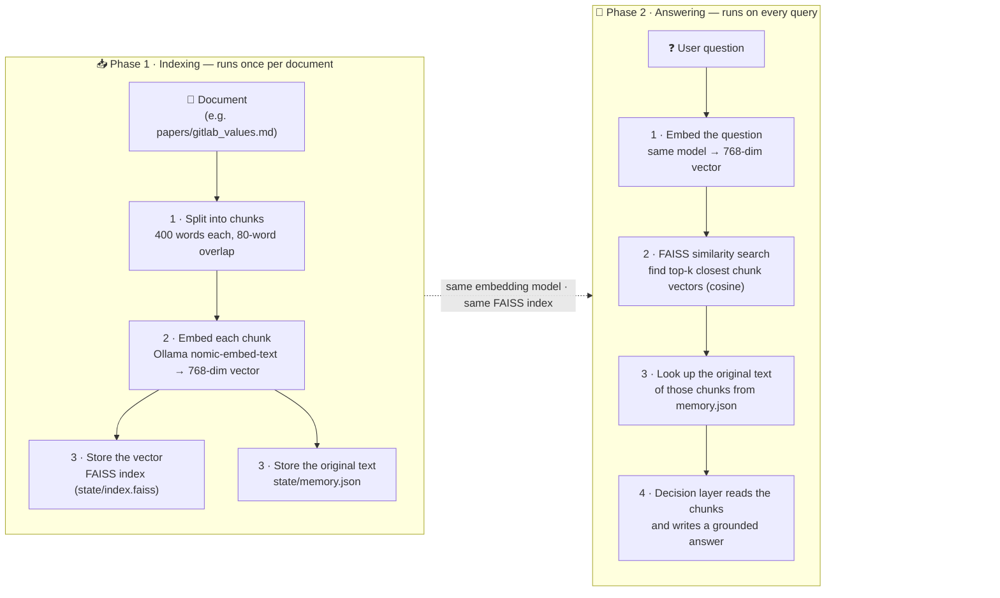
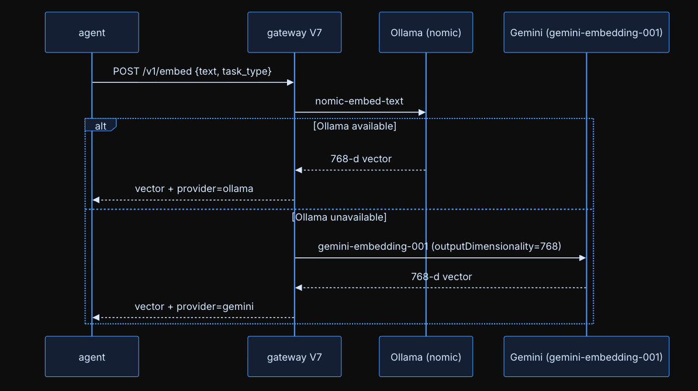
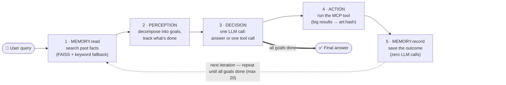

<h1 align="center">
  
</h1>

An autonomous AI agent that plans multi-step tasks, calls real tools over MCP, indexes documents into a local vector store, and **remembers what it learned across runs**. Built in Python with a strictly typed 5-layer architecture, FAISS semantic search, local embeddings via Ollama, and a multi-provider LLM gateway with automatic model routing.

> Ask it *"How does this paper handle the credit assignment problem?"* and it finds the right chunks even if that exact phrase never appears in the document — because retrieval works on **meaning**, not keywords.

---

## 📚 The RAG Pipeline in Detail

RAG happens in two separate phases. **Phase 1 runs once per document** (indexing); **Phase 2 runs on every question** (retrieval + answer).



Phase 1 is the `index_document` tool; Phase 2 is `search_knowledge` plus a final Decision call. What each step does:

| Phase | Step | What happens |
|---|---|---|
| `INDEX` | 1 · Chunk | Sliding word window over the document — **400 words** per chunk, **80-word** overlap |
| `INDEX` | 2 · Embed | Each chunk → **768-dim** vector via Ollama `nomic-embed-text` |
| `INDEX` | 3 · Store | Vector into `state/index.faiss`; the original text into `state/memory.json` |
| `ANSWER` | 1 · Embed | The question → 768-dim vector using the **same** model — this is what makes the match work |
| `ANSWER` | 2 · Search | FAISS `IndexFlatIP` over L2-normalized vectors (= cosine similarity); returns the top-k nearest chunks |
| `ANSWER` | 3 · Resolve | Map the returned ids back to their original chunk text in `memory.json` |
| `ANSWER` | 4 · Answer | Decision layer reads those chunks and writes a grounded answer |


### How retrieval and embeddings work

Every memory read embeds the query and searches FAISS first, falling back to keyword-overlap scoring over `memory.json` when vectors return nothing — retrieval degrades gracefully instead of failing silently. And the agent never talks to an embedding provider directly: it POSTs to the gateway's `/v1/embed`, which prefers local Ollama (`nomic-embed-text`) and transparently falls back to Gemini (`gemini-embedding-001`, pinned to 768 dims) when Ollama is unavailable.

<p align="center">
  <br>
  <sub><b>Embedding call</b> — Ollama preferred, Gemini fallback (768-d)</sub>
</p>


The GitLab company handbook (~30 real-world policy documents covering engineering, hiring, finance, legal, security, and culture) is included in `sandbox/papers/` as the retrieval corpus.

---

## ✨ Key Features

- **Agentic loop** — decomposes a query into goals, then plans → acts → observes → re-plans for up to 20 iterations until every goal is done
- **Persistent vector memory** — facts, preferences, and tool outcomes survive restarts; stored in FAISS (768-dim embeddings) + JSON
- **True RAG pipeline** — chunk → embed → index → semantic retrieval → grounded synthesis, all running locally
- **11 real tools over MCP** — web search, URL fetching, timezone/currency utilities, a sandboxed filesystem, document indexing, and knowledge search
- **Content-addressed artifact store** — large tool outputs (fetched pages, big files) are stored by SHA-256 hash and passed by reference, keeping LLM prompts small
- **Multi-provider LLM gateway** — one API over Gemini, Groq, Cerebras, and GitHub Models with per-layer model routing (small models for cheap steps, large models for reasoning) and automatic failover
- **Typed contracts everywhere** — every layer exchanges Pydantic models, never loose dicts, so failures surface at the boundary instead of deep inside a prompt

---

## 🏗 Architecture

The agent is five single-responsibility layers connected by typed schemas. Each iteration of the main loop flows through all of them:



Everything above runs inside the `agent7.py` loop. What each step does:

| Step | Layer | What happens |
|---|---|---|
| 1 | `MEMORY.read` | FAISS vector search over stored items; keyword-overlap fallback if vectors miss |
| 2 | `PERCEPTION` | Iteration 1: decompose the query into goals. Later: mark goals done, pick the next goal, decide if raw artifact bytes are needed |
| 3 | `DECISION` | ONE LLM call — returns either a final answer or exactly one tool call, never both |
| 4 | `ACTION` | Execute the MCP tool; results over 4 KB go to the artifact store and come back as `art:<hash>` |
| 5 | `MEMORY.record` | Persist the outcome with zero LLM calls |

**Separation of concerns is enforced, not aspirational.** Perception never sees tool names. Decision makes exactly one LLM call per turn. Action never calls an LLM at all. Memory writes on the hot path (`record_outcome`) use zero LLM calls so tool results are never lost to a flaky model.

### Components

| File | Responsibility |
|---|---|
| `agent7.py` | Main loop, goal tracking, artifact resolution, rate-limit pacing |
| `perception.py` | Query → goals; goal completion tracking; artifact-attachment decisions |
| `decision.py` | The single reasoning call: answer or one `ToolCall` |
| `action.py` | Pure MCP dispatcher + artifact-store guard rails |
| `memory.py` | 4 memory kinds (`fact`, `preference`, `tool_outcome`, `scratchpad`), vector + keyword retrieval |
| `vector_index.py` | FAISS `IndexFlatIP` on L2-normalized vectors (= cosine similarity), persisted to disk |
| `artifacts.py` | SHA-256 content-addressed blob store with metadata sidecars, dedup by hash |
| `mcp_server.py` | The 11 MCP tools (FastMCP, stdio transport) |
| `gateway.py` | Client for the LLM gateway; auto-starts it; exposes `LLM` and `embed()` |
| `schemas.py` | All Pydantic contracts: `MemoryItem`, `Goal`, `Observation`, `DecisionOutput`, `ToolCall`, `Artifact` |

---

## 🔄 The Process — What Actually Happens on a Query

Walkthrough for `uv run agent7.py "Index papers/gitlab_values.md and summarise the core values"`:

| Step | Stage | What happens |
|---|---|---|
| 1 | `BOOT` | `ensure_gateway()` health-checks the LLM gateway on port 8107 and auto-starts it if it's down |
| 2 | `MEMORY.read` | The query is embedded (768-dim, `nomic-embed-text` via Ollama) and searched against FAISS; relevant past facts/outcomes are attached as context |
| 3 | `PERCEPTION` | Iteration 1 — an LLM call decomposes the query into goals: ① index the document, ② summarise the core values |
| 4 | `DECISION` | Sees goal ① and memory context, returns `ToolCall(index_document, {path: "papers/gitlab_values.md"})` |
| 5 | `ACTION` | The MCP server chunks the file with a sliding window (**400 words per chunk, 80-word overlap**), embeds each chunk, and writes each one as a `fact` into memory + FAISS. The outcome is recorded without any LLM involvement |
| 6 | `PERCEPTION` | Next iteration (after a 12 s pace to respect free-tier rate limits) — marks goal ① done, moves to goal ②, and because it's a synthesis goal, flags that retrieved content should be attached |
| 7 | `DECISION` | Calls `search_knowledge("GitLab core values")`; FAISS returns the nearest chunks by cosine similarity; a final Decision call reads those chunks and writes the grounded answer |
| 8 | `MEMORY.record` | The answer and tool outcomes persist to `state/`, so a future run can answer follow-ups without re-indexing |

### Model routing

Every layer calls the gateway with `auto_route="<layer>"`. The gateway maps each layer to an appropriately sized model tier — cheap/fast models for perception and memory classification, large models for decision-making — and fails over across providers (`gemini → groq → cerebras → github`) when one is rate-limited or down.

---

## 🛠 The 11 MCP Tools

| Tool | What it does |
|---|---|
| `get_time` | Current time in any timezone |
| `currency_convert` | Live currency conversion |
| `read_file` / `list_dir` | Read files / list dirs (sandboxed to `./sandbox/`) |
| `create_file` / `update_file` / `edit_file` | Sandboxed file creation, overwrite, find-and-replace |
| `index_document` | Chunk + embed + persist a document into FAISS-searchable memory |
| `search_knowledge` | Semantic vector search over everything indexed |

All file tools are jailed to `sandbox/` — the agent cannot touch anything outside it.

---

## 🚀 Setup — step by step

Follow the steps **in order**. Each step says what it does and how to check it worked.

**Before you start, you need:**

| Tool | What it's for | Install |
|---|---|---|
| Python 3.11+ | runs everything | `brew install python` (or python.org) |
| [uv](https://docs.astral.sh/uv/) | Python package manager | `curl -LsSf https://astral.sh/uv/install.sh \| sh` |
| [Ollama](https://ollama.com) | local embedding model (free, no key) | `brew install ollama` |
| 1 LLM API key | the agent's brain — Gemini **or** Groq **or** Cerebras, any one | free tier at each provider |
| Tavily API key | web search tool | free tier at [tavily.com](https://tavily.com) |

### 

```bash
git clone https://github.com/SIDDHIK-355/7.Agentic-RAG-System-for-Document-Question-Answering.git
cd 7.Agentic-RAG-System-for-Document-Question-Answering
```

### 

```bash
cd My_Assignment
uv sync
```

✅ *Check:* `uv run python -c "import faiss; print('ok')"` prints `ok`.

### 

```bash
ollama serve &                  # skip if Ollama is already running
ollama pull nomic-embed-text    # 768-dim embedding model (~270 MB)
```

✅ *Check:* `ollama list` shows `nomic-embed-text`.

### 

Real `.env` files are gitignored — only templates are committed, so you create yours from them:

```bash
cp ../.env.example ../.env      # gateway keys → open ../.env, paste ONE LLM key (GEMINI_API_KEY or GROQ_API_KEY …)
cp .env.example .env            # agent key   → open .env, paste TAVILY_API_KEY
```

### 

```bash
uv run index_corpus.py
```

This chunks all 76 handbook files, embeds each chunk with Ollama, and saves the FAISS index under `state/`. The LLM gateway auto-starts on port 8107 (first boot takes ~45 s — be patient).

✅ *Check:* the last line says `done: 76 files indexed (753 chunks)`.

### 

```bash
# basic agent check (uses web tools)
uv run agent7.py "What is the current time in Tokyo and Bangalore?"

# RAG check — answers ONLY from the indexed handbooks, web tools disabled
uv run agent7.py --no-web "What does GitLab mean by 'short toes', and what example do they give about the CEO?"
```

✅ *Check:* the second answer mentions the CEO's own merge request being closed — a detail that only exists in the indexed corpus.

### -64748b?style=for-the-badge&labelColor=000000)

```bash
uv run pytest test_mcp_server.py -v              # offline tests
uv run pytest test_mcp_server.py -v -m network   # tests needing web/API access
uv run pytest test_mcp_server.py -v -m embed     # tests needing the embed endpoint
```

### 

| Symptom | Cause | Fix |
|---|---|---|
| First run hangs ~45 s | gateway cold boot | wait; check `curl -s http://localhost:8107/v1/routers` |
| `connection refused` on embeddings | Ollama not running | `ollama serve` |
| LLM errors on every call | missing/wrong key in `../.env` | paste a valid key for at least one provider |
| `web_search` fails | missing `TAVILY_API_KEY` in `.env` | add it, or use `--no-web` queries |
| Want a clean slate | old index/memory | `python -c "import memory; memory.clear()"`, then redo Step 5 |

---

## 🗺 Roadmap

- **Semantic chunking** — replace the sliding word-window with boundary-aware chunking
- **Reranking** — a lightweight cross-encoder pass over FAISS candidates
- **Approximate indexing** — move to IVF/HNSW when the corpus outgrows brute force

---

## 📂 Repository Layout

```
Session_7/
├── README.md                  ← you are here
├── .env.example               template for the gateway's LLM provider keys
│
├── My_Assignment/             🤖 THE AGENT — all source code
│   ├── agent7.py                  main loop (20 iterations max, --no-web flag)
│   ├── perception.py              query → goals, goal tracking (no tool names!)
│   ├── decision.py                one LLM call: final answer OR one tool call
│   ├── action.py                  MCP tool dispatcher (big results → artifacts)
│   ├── memory.py                  4 memory kinds, FAISS + keyword retrieval
│   ├── vector_index.py            FAISS wrapper (cosine similarity, persisted)
│   ├── artifacts.py               SHA-256 content-addressed blob store
│   ├── gateway.py                 client for the LLM gateway (auto-starts it)
│   ├── mcp_server.py              11 MCP tools (search, files, index, retrieve)
│   ├── schemas.py                 all Pydantic contracts between layers
│   ├── fetch_corpus.py            downloads the 5 company handbooks
│   ├── index_corpus.py            one-command batch indexer (76 files → chunks)
│   ├── demo_queries.sh            one-file runner: gateway + index + demo queries
│   ├── test_mcp_server.py         pytest suite for the MCP tools
│   ├── .env.example               template for the agent's Tavily key
│   ├── sandbox/                   🔒 the only folder file-tools can touch
│   │   └── papers/                    📚 THE CORPUS — 76 handbook files, 5 companies
│   │                                  (gitlab_*, basecamp_*, sourcegraph_*,
│   │                                   posthog_*, niteo_*)
│   └── state/                     runtime state (gitignored, rebuilt by indexer)
│       ├── memory.json                all memory items incl. document chunks
│       ├── index.faiss                the FAISS vector index (768-dim)
│       ├── index_ids.json             FAISS position → memory-item id map
│       └── artifacts/                 content-addressed blobs from big tool results
│
├── Gateway_Code/              🌐 THE LLM GATEWAY (instructor's service)
│   └── llm_gatewayV7/             FastAPI, port 8107 — one API over Gemini/Groq/
│                                  Cerebras/GitHub Models + /v1/embed via Ollama
│
├── traces/                    🧾 test-run outputs (submission evidence)
│   ├── custom_queries/with_index/     5 queries answered from the corpus
│   ├── custom_queries/without_index/  same 5 failing after index deletion
│   └── grounding_demo/                in-corpus vs out-of-corpus proof runs
│
└── docs/                      images used by this README
```

**Stack:** Python · Pydantic · FAISS · Ollama (`nomic-embed-text`) · FastMCP · FastAPI gateway · Gemini / Groq / Cerebras / GitHub Models · Tavily
